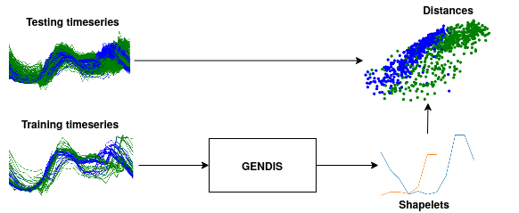

# GENDIS [](https://travis-ci.org/IBCNServices/GENDIS) [](https://badge.fury.io/py/GENDIS) [](https://gendis.readthedocs.io/en/latest/?badge=latest) [](https://pepy.tech/project/gendis)
## GENetic DIscovery of Shapelets 

<p align="center">
  
</p>

<p align="center">
  
</p>

In the time series classification domain, shapelets are small subseries that are discriminative for a certain class. It has been shown that by projecting the original dataset to a distance space, where each axis corresponds to the distance to a certain shapelet, classifiers are able to achieve state-of-the-art results on a plethora of datasets.

This repository contains an implementation of `GENDIS`, an algorithm that searches for a set of shapelets in a genetic fashion. The algorithm is insensitive to its parameters (such as population size, crossover and mutation probability, ...) and can quickly extract a small set of shapelets that is able to achieve predictive performances similar (or better) to that of other shapelet techniques.

## Installation

We currently support Python 3.5 & Python 3.6. For installation, there are two alternatives:

1. Clone the repository `https://github.com/IBCNServices/GENDIS.git` and run `(python3 -m) pip -r install requirements.txt`
2. GENDIS is hosted on PyPi. You can just run `(python3 -m) pip install gendis` to add gendis to your dist-packages (you can use it from everywhere).

**Make sure NumPy and Cython is already installed (`pip install numpy` and `pip install Cython`), since that is required for the setup script.**

## Tutorial & Example

### 1. Loading & preprocessing the datasets

In a first step, we need to construct at least a matrix with timeseries (`X_train`) and a vector with labels (`y_train`). Additionally, test data can be loaded as well in order to evaluate the pipeline in the end.

```python
import pandas as pd
# Read in the datafiles
train_df = pd.read_csv(<DATA_FILE>)
test_df = pd.read_csv(<DATA_FILE>)
# Split into feature matrices and label vectors
X_train = train_df.drop('target', axis=1)
y_train = train_df['target']
X_test = test_df.drop('target', axis=1)
y_test = test_df['target']
```

### 2. Creating a `GeneticExtractor` object

Construct the object. For a list of all possible parameters, and a description, please refer to the documentation in the [code](gendis/genetic.py)

```python
from gendis.genetic import GeneticExtractor
genetic_extractor = GeneticExtractor(population_size=50, iterations=25, verbose=False, 
                                     normed=False, add_noise_prob=0.3, add_shapelet_prob=0.3, 
                                     wait=10, plot='notebook', remove_shapelet_prob=0.3, 
                                     crossover_prob=0.66, n_jobs=4, max_len=len(X_train) // 2)
```

### 3. Fit the `GeneticExtractor` and construct distance matrix

```python
shapelets = genetic_extractor.fit(X_train, y_train)
distances_train = genetic_extractor.transform(X_train)
distances_test = genetic_extractor.transform(X_test)
```

### 4. Fit ML classifier on constructed distance matrix

```python
from sklearn.linear_model import LogisticRegression
from sklearn.metrics import accuracy_score
lr = LogisticRegression()
lr.fit(distances_train, y_train)

print('Accuracy = {}'.format(accuracy_score(y_test, lr.predict(distances_test))))
```

### Example notebook

A simple example is provided in [this notebook](gendis/example.ipynb)

## Data

All datasets in this repository are downloaded from [timeseriesclassification](http://timeseriesclassification.com). Please refer to them appropriately when using any dataset.

## Paper experiments

In order to reproduce the results from the corresponding paper, please check out [this directory](gendis/experiments).

## Tests

We provide a few doctests and unit tests. To run the doctests: `python3 -m doctest -v <FILE>`, where `<FILE>` is the Python file you want to run the doctests from. To run unit tests: `nose2 -v`

## Contributing, Citing and Contact

If you have any questions, are experiencing bugs in the GENDIS implementation, or would like to contribute, please feel free to create an issue/pull request in this repository or take contact with me at gilles(dot)vandewiele(at)ugent(dot)be

If you use GENDIS in your work, please use the following citation:
```bibtex
@article{vandewiele2021gendis,
  title={GENDIS: Genetic Discovery of Shapelets},
  author={Vandewiele, Gilles and Ongenae, Femke and Turck, Filip De},
  journal={Sensors},
  volume={21},
  number={4},
  pages={1059},
  year={2021},
  publisher={Multidisciplinary Digital Publishing Institute}
}
```
