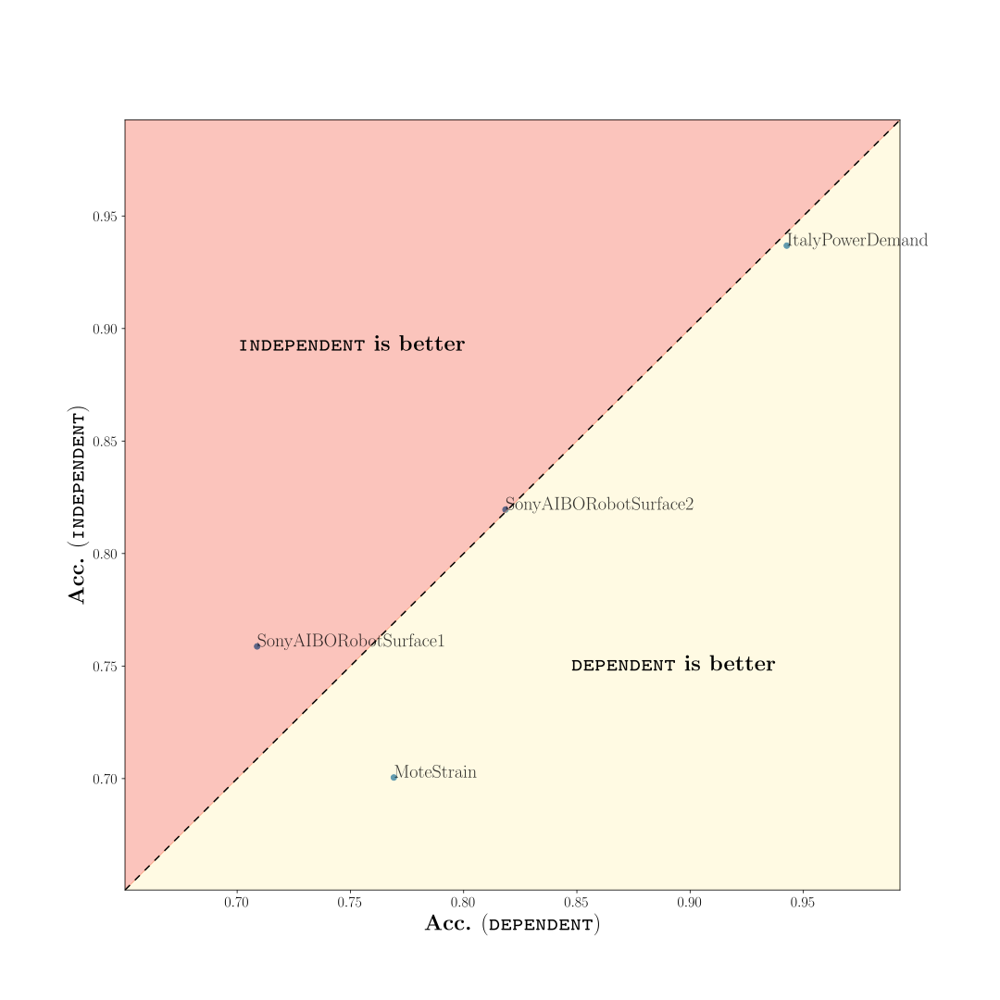
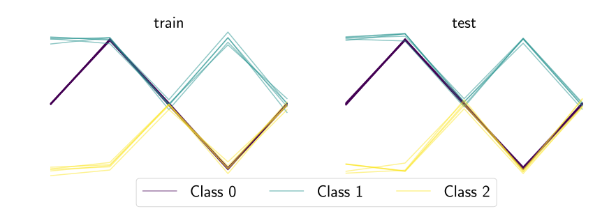
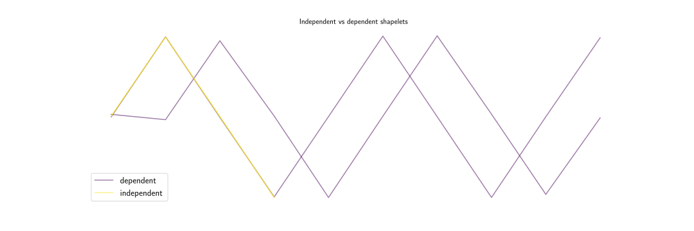
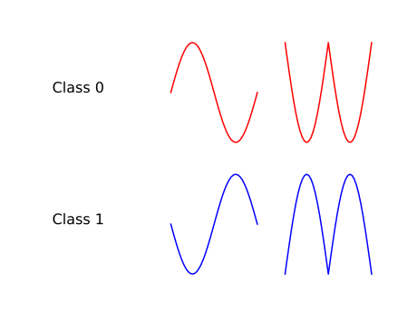
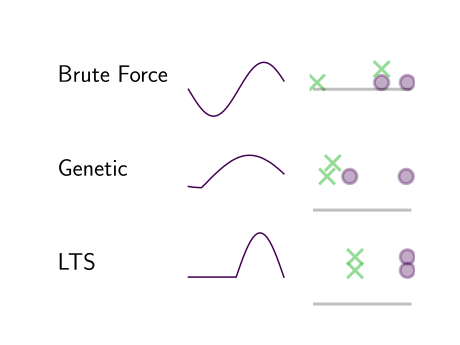
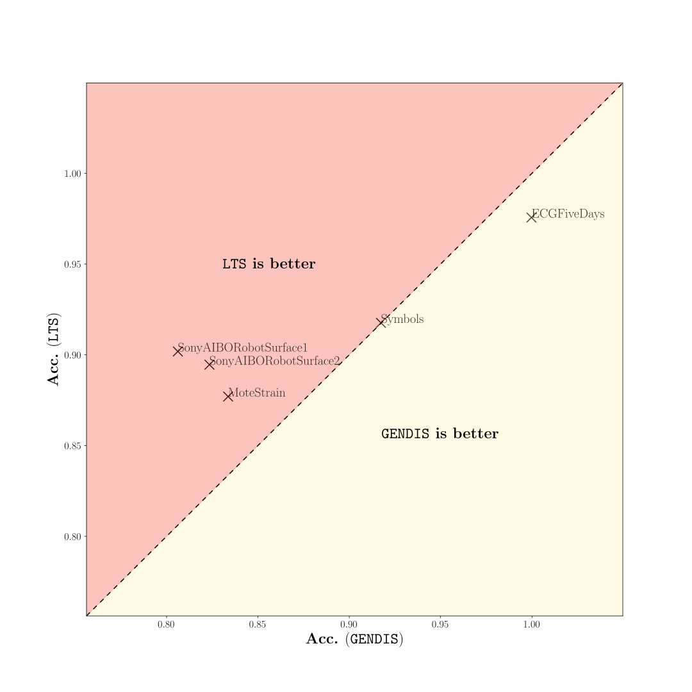

### EXPERIMENT 1: Dependent vs independent discovery

We provide two experiments to show the importance of introducing a notion of dependence between the extracted shapelets, used to construct the distance matrix in the end. Both LTS and GENDIS introduce this notion by assessing sets of shapelets in their entirety, instead of single shapelets individually.

#### EXPERIMENT 1.1: Benchmark datasets

We compare a dependent and independent approach on 32 benchmark datasets of which the [Fast Shapelets algorithm](https://epubs.siam.org/doi/abs/10.1137/1.9781611972832.74) has the lowest expected computational runtime. For the dependent approach, we extract shapelets in the same fashion as the original algorithm: we partition our dataset after each extracted shapelet and continue recursively to form a decision tree. Since a decision tree can be a rather weak classifier, we extract all the shapelets from the tree in the end and use these to construct a distance matrix. For the independent approach, we use the [Shapelet Transform algorithm](http://wan.poly.edu/KDD2012/docs/p289.pdf) as proposed by Lines et al. Run `python3 dependent_vs_independent_benchmarks.py` to create multiple files for each tested benchmark dataset in `results/dependent_vs_independent`. You can repeat this multiple times in order to have a few measurements. Afterwards, `python3 process_results.py` can be run in order to generate a scatter plot that compares both approaches. 

**IMPORTANT:** most of the datasets are commented out, such that a quicker run can be done on five small datasets first. In order to conduct the experiment on all 32 datasets (or more), you will have to enable these datasets manually in the code.

#### EXPERIMENT 1.2: Artificial dataset

We construct an imbalanced three-class dataset and show that the independent approach is not able to achieve perfect predictive performance as opposed to the dependent approach. Run `python3 dependent_vs_independent_artificial.py`. Three SVG images will be created in the `results/` directory. One displaying the generated train and test set (`data.svg`), one depicting the two discovered shapelets of both approaches (`shapelets.svg`) and a scatter plot that display the distances to two extracted shapelets for both approaches (`scatter_.*.svg`).

  

 

### EXPERIMENT 2: Simple artificial two-class problem that cannot be solved by brute-force approach

In this experiment, we show the importance of discovering shapelets that cannot be directly found in the data. Run `python3 single_shapelet`. Two SVG images will be generated. One displaying the generated data (`shap_artificial.svg`) and one displaying the extracted shapelet of three approaches (`extracted_shapelets.svg`) and the distances of each timeseries to that shapelet.

 

### EXPERIMENT 4: [LTS](https://www.ismll.uni-hildesheim.de/pub/pdfs/grabocka2014e-kdd.pdf) vs GENDIS

Similarly to the dependent vs independent experiment, run `python3 lts_vs_gendis.py` a few times to create measurement files in `results/lts_vs_gendis`. Afterwards, run `python3 process_results.py` to compare the predictive performances of both approaches. If you performed more than one rune, the `process_results` script will also conduct statistical hypothesis tests. The `lts_vs_gendis` will also write the runtimes and the extracted shapelets to disk for analysis (compare runtimes and model complexities).

**IMPORTANT:** most of the datasets are commented out, such that a quicker run can be done on five small datasets first. In order to conduct the experiment on all 20 datasets (or more), you will have to enable these datasets manually in the code.

#### EXPERIMENT 4.1: LTS with smaller shapelet dicts: predictive performance assessment

For this experiment, we need to run the LTS vs GENDIS experiment first, since the files generated by that experiment contain the sizes of the shapelet sets discovered by GENDIS. Then run `python3 lts_small.py` and files for analysis will be created in `results/lts_smaller`.

### EXPERIMENT 5: Hyper-parameter sensitivity of GENDIS and LTS

Run the `python3 hyper_parameter_sensitivity.py`. This will perform 5 measurements on the ItalyPowerDemand dataset with random hyper-parameter configurations for GENDIS and LTS. The results will be written away to `results/gendis_hyperparams.csv` and `results/lts_hyperparams.csv`.