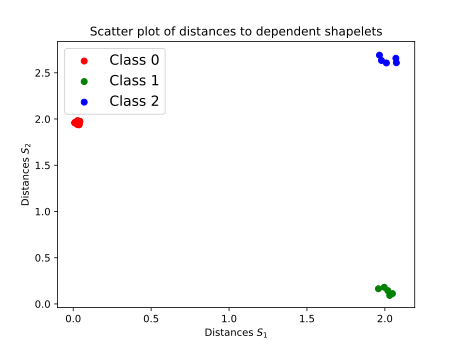
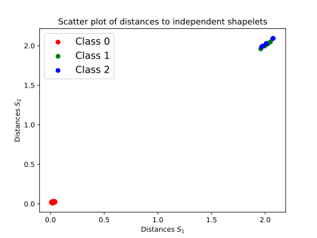

## Please note that the shapelet discovery process takes a significant amount of time for most datasets.

### Dependent vs independent discovery

We provide two experiments to show the importance of assessing sets of shapelets in their entirety, instead of single shapelets individually.

#### Benchmark datasets

To evaluate both the dependent and independent discovery on a bunch of benchmark datasets, run `python3 dependent_vs_independent_benchmarks.py`. This will create multiple files for each tested benchmark dataset in `results/dependent_vs_independent`. You can repeat this multiple times in order to have a few measurements. Afterwards, `python3 process_results.py` can be run in order to generate a scatter plot that compares both approaches. 

#### Artificial dataset

Run `python3 dependent_vs_independent_artificial.py`. Four SVG images will be created in the `results/` directory. One displaying the generated train and test set (`data.svg`), one depicting the two discovered shapelets of both approaches (`shapelets.svg`) and two scatter plots that display the distances to two extracted shapelets (`scatter_.*.svg`).

  

  

### Simple artificial two-class problem that cannot be solved by brute-force approach

Run `python3 single_shapelet`. Two SVG images will be generated. One displaying the generated data (`shap_artificial.svg`) and one displaying the extracted shapelet of three approaches (`extracted_shapelets.svg`)

 

### [LTS](https://www.ismll.uni-hildesheim.de/pub/pdfs/grabocka2014e-kdd.pdf) vs GENDIS

Similarly to the dependent vs independent experiment, run `python3 lts_vs_genetic.py` a few times to create measurement files in `results/lts_vs_genetic`. Afterwards, run `python3 process_results.py`

### LTS with smaller shapelet dicts: predictive performance assessment

For this experiment, we need to run the LTS vs GENDIS experiment first, since the files generated by that experiment contain the sizes of the shapelet sets discovered by GENDIS. Then run `python3 lts_small.py`.

### Hyper-parameter sensitivity of GENDIS and LTS